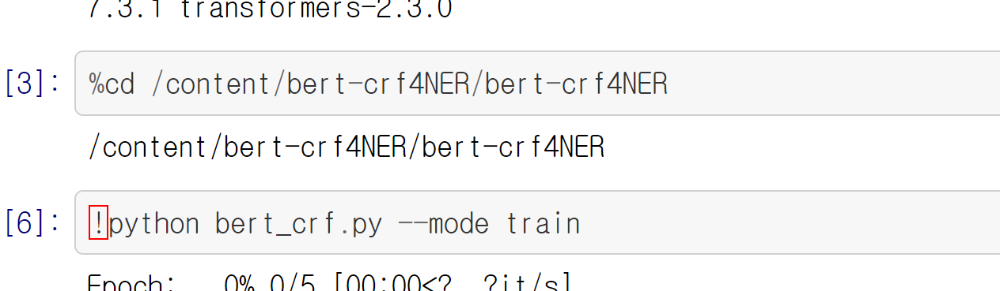

# NER Model

# 돌려봄

- BERT-CRF-ENTITY

    [GitHub - devjwsong/bert-crf-entity-recognition-pytorch: Entity recognition using BERT + CRF for single-tun / multi-turn setting in dialogues](https://github.com/devjwsong/bert-crf-entity-recognition-pytorch)

    # 방향성

    일단 몇개 데이터 포맷 맞춰서 만든다음 넣어보는게 좋을듯함

    - [ ]  모델 다운받아서 돌려보기
        - [ ]  깃헙에서 !쓰고 cli명령어 치면 되는듯

            

        - [ ]  그냥 돌려볼때는 에포크 2정도로만 바꿔서 해보기
    - [ ]  자막데이터 만들기
    - [ ]  돌려서 성능 확인하기

    # 단점

    - 발화데이터여서 우리가 원하는 데이터 나오지 않을 가능성

    # 특징

    - 발화 데이터 사용
    - $$$으로 데이터 구분
    - 한국인이 만듬

    ### sample data 오류

    [https://github.com/devjwsong/bert-crf-entity-recognition-pytorch/issues/1](https://github.com/devjwsong/bert-crf-entity-recognition-pytorch/issues/1)

    사용가능

    - sports.txt
    - restaurant-search.txt
    - food-ordering.txt

    restaurant-search.txt 랑 관련있으니 이거로 해보기

    ### bert_config.dim 오류 수정

    ```
    # original
    self.config['hidden_size'] = bert_config.dim

    # fixed
    self.config['hidden_size'] = bert_config.hidden_size

    ```

    # 데이터

    ## 구조

    

    ## 실제 데이터

    ### 전처리 전

    

    ### 전처리 후

    **src/data_process.py 사용**

    **inputs**

    

    **labels**

    

# 예정

- NER-BERT-CRF

    [GitHub - Louis-udm/NER-BERT-CRF](https://github.com/Louis-udm/NER-BERT-CRF)

    # 방향성

    일단 파이썬 파일 하나로 되어있어서 코랩에서 돌리기에도 좋을듯함

    그냥 다 복사해서 노트북 파일에 넣어도 될듯

    ## To do

    - [ ]  돌려보기
    - [ ]  모델 구조
        - [ ]  함수가 하는 역활
        - [ ]  어떤 pre-trained 모델 사용하는지
        - [ ]  무슨 라이브러리 사용하는지
            - **예시**
            - BERT-base ← transformers
            - CRF ← pytorch
    - [ ]  Data
        - [ ]  어떤 데이터 사용
        - [ ]  데이터의 구조
        - [ ]  우리가 데이터 변경 어떻게 할지
    - [ ]  우리에 맞게 fine-tune가능한지
    - [ ]  성능은 괜찮은지
    - [ ]  코랩에서 1 epoch 당 시간

# 보류

- BERT-BiLSTM-CRF

    [GitHub - macanv/BERT-BiLSTM-CRF-NER: Tensorflow solution of NER task Using BiLSTM-CRF model with Google BERT Fine-tuning And private Server services](https://github.com/macanv/BERT-BiLSTM-CRF-NER)

    # 방향성

    일단 보류

    # 단점

    - 중국어로 써있는게 많음

    # 특징

    - Bilstm사용했다는데 BERT가 LSTM대신해서 굳이 필요한가 싶음
        - 출처

            

        - 그래서 위 모델 먼저 해보는게 좋을듯

# ???

[GitHub - Dhanachandra/bert_crf: BERT CRF model for Name Entity Recognition in pytorch](https://github.com/Dhanachandra/bert_crf)